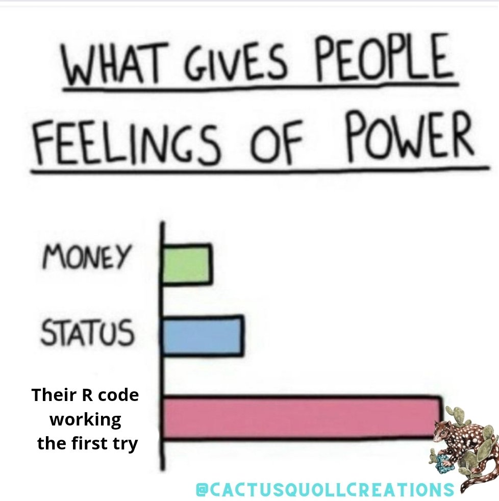

```{r setup, include = FALSE, eval = TRUE}

options(htmltools.dir.version = FALSE)

library(knitr)
library(dplyr)
library(stringr)
library(tidyr)
library(wildRtrax)
library(purrr)


opts_chunk$set(
  #prompt = T,
  fig.align="center", #fig.width=6, fig.height=4.5, 
  # out.width="748px", #out.length="520.75px",
  dpi=300, #fig.path='Figs/',
  cache=T#, echo=F, warning=F, message=F
  )

hook_source <- knitr::knit_hooks$get('source')
knitr::knit_hooks$set(source = function(x, options) {
  x <- stringr::str_replace(x, "^[[:blank:]]?([^*].+?)[[:blank:]]*#<<[[:blank:]]*$", "*\\1")
  hook_source(x, options)
})

```

```{css, echo=FALSE}
/* custom.css */
.left-code {
  color: #777;
  width: 40%;
  height: 92%;
  float: left;
}
.left-code-less {
  color: #777;
  width: 25%;
  height: 92%;
  float: left;
}
.right-plot {
  width: 58%;
  float: right;
  padding-left: 1%;
}
.right-plot-more {
  width: 65%;
  float: right;
  padding-left: 1%;
}
.plot-callout {
  height: 225px;
  width: 450px;
  bottom: 5%;
  right: 5%;
  position: absolute;
  padding: 0px;
  z-index: 100;
}
.plot-callout img {
  width: 100%;
  border: 4px solid #23373B;
}

```

# Roadmap

.pull-left[
## 1. My niche:
<br>
## 2. [(One) Available Tool:](#wt)
<br>
## 3. [{wildRtrax}📦](#wrt)
<br>
<br>
<br>
## 4. What do *you* need?
]

.pull-right[

<br>
<br>
<br>

<br>
<br>

]

---
# Our focus today:
<br>
<br>


<br>
<br>
--
**i.e. the boring parts!!!**
--
<br>
We might dip into viz just to keep ourselves sane.
--
<br>
*N.B.* We're going to get technical. The horror!

---

# Oops. I'm sorry.

I realized this morning that this may be the first remote cameras presentation in history with no cute animal pictures.

--

<br>


---
# My (innocent?) workflow biases

<br>
### If I can, I want to do everything in R.<sup>1</sup> 

.footnote[<sup>1</sup>Generally, tidyverse-style. Sorry, purists!]

--

<br>
### I'm going to show you how I use [WildTrax](#wt), but it is one tool of many.

--

<br>
### There are many flavours of camera data analyses, and I am familiar with only a small number.

---
class: inverse, center, middle
name: wt

# WildTrax

<html><div style='float:left'></div><hr color='#EB811B' size=1px width=796px></html>

---

# What is WildTrax?

<br>
+ An online platform for storing, managing, processing, and sharing biological data collected by environmental sensors (ie. remote cameras).

--

+ Delivers multiple functions:
  - Project and user management
  - Data management and storage
  - Data processing<sup>1</sup>
  - Data export/download
  
---
count: false

# What is WildTrax?

<br>
+ An online platform for storing, managing, processing, and sharing biological data collected by environmental sensors (ie. remote cameras).

+ Delivers multiple functions:
  - Project and user management
  - Data management and storage
  - Data processing<sup>1</sup>
  - **Data export/download**
  
### This is where we're going to pick up the story today. 

---
count: false

# What is WildTrax?

<br>
+ An online platform for storing, managing, processing, and sharing biological data collected by environmental sensors (ie. remote cameras).

+ Delivers multiple functions:
  - Project and user management
  - Data management and storage
  - Data processing<sup>1</sup>
  - **Data export/download**
  
### This is where we're going to pick up the story today. 


<br>
.footnote[<sup>1</sup>It's possible (likely) that you prefer to do this piece of the work on a different platform. There are tools available to **import not just your images but also any tags that you've previously made** into WildTrax.]

---

# Data Export/Download

<br>

## [How is this done through WildTrax?](www.wildtrax.ca)

--

<br>
<br>

OK, that works.

<br>
<br>

--

But I'm biased, remember? 
<br>
<br>
Tedious tasks can often be replaced with an R script. And often this is a good idea when the task is prone to errors.   

---
class: inverse, center, middle
name: wrt

# {wildRtrax}📦

<html><div style='float:left'></div><hr color='#EB811B' size=1px width=796px></html>

---
# Installing {wildRtrax}📦

<br>
```{r, echo=TRUE, eval=FALSE, message=FALSE, include=TRUE}

# Use the remotes package to install wildRtrax directly from Github.
# Use `@main` to ensure you are downloading the primary branch.

remotes::install_github("ABbiodiversity/wildRtrax@main")

# Once installed, attach the package.

library(wildRtrax)

```

---
# Authenticating into WildTrax

```{r, echo=TRUE, eval=FALSE, message=FALSE, include=TRUE}

# First we need to set up our username/pass as environment variables
# Note: Need to be `WT_USERNAME` and `WT_PASSWORD`. 

Sys.setenv(WT_USERNAME = "guest", WT_PASSWORD = "Apple123")

```

--

These values live only on your device. But **be careful** about including sensitive information in a script that you may (inadvertently) share!

--

```{r, echo=TRUE, eval=FALSE, message=FALSE, include=TRUE}

# One solution - the `keyring` package.

library(keyring)

keyring_create("wildtrax")
key_set("WT_USERNAME", keyring = "wildtrax")
key_set("WT_PASSWORD", keyring = "wildtrax")

# This is now safe for my script!
Sys.setenv(WT_USERNAME = key_get("WT_USERNAME", keyring = "wildtrax"),
           WT_PASSWORD = key_get("WT_PASSWORD", keyring = "wildtrax"))


```

---

# Authenticating into WildTrax

```{r echo=TRUE, eval=TRUE, message=TRUE, include=TRUE, cache = TRUE}

# Now, all you need to do is run one function. With no arguments!!!

wt_auth() #<<

```

---
count:false

# Authenticating into WildTrax

```{r echo=TRUE, eval=FALSE, message=TRUE, include=TRUE, cache = TRUE}

# Now, all you need to do is run one function. With no arguments!!!

wt_auth() 

```
<br>
**So what's going on beneath the hood?**

```{r, echo=TRUE, eval=TRUE, message=TRUE, include=TRUE}

# Upon attachment, wildRtrax creates a new hidden environment (`._wt_auth_env_`) 
# wt_auth() obtains an Auth0 token from WildTrax and stores it in this environment,
# along with some other values. 

str(names(wildRtrax:::._wt_auth_env_)) #<<

```

--

```{r, echo=TRUE, eval=TRUE, message=TRUE, include=TRUE}

# For example, your token expires after 8 hours. Check it's expiry time:
wildRtrax:::._wt_auth_env_$expiry_time #<<

```

---

# So what?

--

### Well, now you can interact with your data directly in R!

```{r, echo=TRUE, eval=TRUE, message=TRUE, include=TRUE, cache = TRUE}

# Your Auth0 token can be supplied to functions that call the WildTrax API. #<<

# Which camera projects do you have access to?
my_projects <- wt_get_download_summary( 
  sensor_id = "CAM"
)

# Print
glimpse(my_projects, width = 75)

```


---

# So what?

The **[`wt_download_report()`](https://abbiodiversity.github.io/wildRtrax/reference/wt_download_report.html)** function mimics the data download on the WildTrax website.

You need to supply the `project_id` value, which we can get from **[`wt_get_download_summary()`](https://abbiodiversity.github.io/wildRtrax/reference/wt_get_download_summary.html)**.

--

```{r echo=TRUE, eval=TRUE, message=TRUE, include=TRUE}

# I'm interested in the ABMI's Ecosystem Health project from 2014

wt_get_download_summary(sensor_id = "CAM") %>% 
  filter(str_detect(project, "Ecosystem Health"),
         year == 2014) %>%
  select(project_id) %>%
  pull() %>%
  unlist()

```

---

# Download data directly into R

<br>

```{r, echo=TRUE, eval=FALSE, message=TRUE, include=TRUE}

eh14_raw <- wt_download_report(
  project_id = 205, #<<
  sensor_id = "CAM",
  cols_def = FALSE,
  weather_cols = FALSE
)

```

```{r, echo=FALSE, eval=TRUE, message=FALSE, include=FALSE, cache = TRUE}

eh14_raw <- wt_download_report(
  project_id = 205,
  sensor_id = "CAM",
  cols_def = FALSE,
  weather_cols = FALSE
)

```

---

# A nice dataframe!

<br>

```{r}
eh14_raw %>% select(1:15) %>% glimpse(width = 75) #<<
```

---

# What about two projects at once?

That's easy too!

```{r echo=TRUE, eval=TRUE, message=TRUE, include=TRUE}

# This time, we want ABMI's Camera Model Comparison projects, from
# three separate years. 

model_comp_ids <- wt_get_download_summary(sensor_id = "CAM") %>% 
  filter(str_detect(project, "Camera Model Comparison")) %>% #<<
  select(project_id) %>%
  pull() %>%
  unlist()

# The object model_comp_ids is a numeric vector
model_comp_ids

```

---

# What about two projects at once?

```{r echo=TRUE, eval=FALSE, message=TRUE, include=TRUE}

# To avoid a for loop ...

library(purrr)

# Now we can feed all 3 values in project_list into `wt_download_report()`.
model_comp_raw <- map_df(.x = model_comp_ids,
                         .f = ~ wt_download_report(
                           project_id = .x,
                           sensor_id = "CAM",
                           cols_def = FALSE,
                           weather_cols = FALSE))
                         
```


```{r echo=TRUE, eval=TRUE, message=TRUE, include=FALSE, cache = TRUE}

model_comp_raw <- map_df(.x = model_comp_ids,
                      .f = ~ wt_download_report(
                        project_id = .x,
                        sensor_id = "CAM",
                        cols_def = FALSE,
                        weather_cols = FALSE
                      ))

```

---

# Stitched together nicely

<br>

```{r}

model_comp_raw %>% select(1:15) %>% glimpse(width = 75)

```

---

# So what?

"You've made a slightly slicker version of `read.csv()`. Big deal."

--

<br>

Well, there are benefits to scripting:

+ Always get the most up-to-date version of the data.
+ Your collaborators are working off the same data that you are.
+ Reproducibility! 
+ Storage schmorage. 

--

<br>

"Surely there are other, more *interesting* functions in wildRtrax."

--

<br>

There sure are!

---

# What's next?

OK, let's orient ourselves back to this framework:

<br>


--

<br>
We've taken care of the **import** part of the pipeline. Let's work on **tidy** and **transform**. 

---

# Transform our camera data

Most of the time, there are additional steps we want to take to transform our data into something more insightful or useful - for, say, modeling.

--

One common task: evaluating **independent detections**.

--

+ There's a function in wildRtrax for that: [`wt_ind_detect()`](https://github.com/ABbiodiversity/wildRtrax/blob/main/R/wt_ind_det.R).
+ It's designed to work with the output (i.e. raw data) from [`wt_download_report()`](https://github.com/ABbiodiversity/wildRtrax/blob/main/R/wt_summarise_cam.R).
+ You specify the detection threshold. 

--

```{r echo=TRUE, eval=TRUE, message=TRUE, include=TRUE, cache = TRUE}

# Back to the Ecosystem Health 2014 data.

eh14_detections <- wt_ind_detect(
  x = eh14_raw,
  threshold = 30,
  units = "minutes",
  remove_human = TRUE,
  remove_domestic = TRUE
)

```

---
count:false

# Transform our camera data

Most of the time, there are additional steps we want to take to transform our data into something more insightful or useful - for, say, modeling.


One common task: evaluating **independent detections**.


+ There's a function in wildRtrax for that: [`wt_ind_detect()`](https://github.com/ABbiodiversity/wildRtrax/blob/main/R/wt_ind_det.R).
+ It's designed to work with the output (i.e. raw data) from [`wt_download_report()`](https://github.com/ABbiodiversity/wildRtrax/blob/main/R/wt_summarise_cam.R).
+ You specify the detection threshold. 


```{r echo=TRUE, eval=FALSE, message=TRUE, include=TRUE}

# Back to the Ecosystem Health 2014 data.

eh14_detections <- wt_ind_detect(
  x = eh14_raw, #<<
  threshold = 30,
  units = "minutes",
  remove_human = TRUE,
  remove_domestic = TRUE
)

```

---
count:false

# Transform our camera data

Most of the time, there are additional steps we want to take to transform our data into something more insightful or useful - for, say, modeling.


One common task: evaluating **independent detections**.


+ There's a function in wildRtrax for that: [`wt_ind_detect()`](https://github.com/ABbiodiversity/wildRtrax/blob/main/R/wt_ind_det.R).
+ It's designed to work with the output (i.e. raw data) from [`wt_download_report()`](https://github.com/ABbiodiversity/wildRtrax/blob/main/R/wt_summarise_cam.R).
+ You specify the detection threshold. 


```{r echo=TRUE, eval=FALSE, message=TRUE, include=TRUE}

# Back to the Ecosystem Health 2014 data.

eh14_detections <- wt_ind_detect(
  x = eh14_raw, 
  threshold = 30, #<<
  units = "minutes", #<<
  remove_human = TRUE,
  remove_domestic = TRUE
)

```

---
count:false

# Transform our camera data

Most of the time, there are additional steps we want to take to transform our data into something more insightful or useful - for, say, modeling.


One common task: evaluating **independent detections**.


+ There's a function in wildRtrax for that: [`wt_ind_detect()`](https://github.com/ABbiodiversity/wildRtrax/blob/main/R/wt_ind_det.R).
+ It's designed to work with the output (i.e. raw data) from [`wt_download_report()`](https://github.com/ABbiodiversity/wildRtrax/blob/main/R/wt_summarise_cam.R).
+ You specify the detection threshold. 


```{r echo=TRUE, eval=FALSE, message=TRUE, include=TRUE}

# Back to the Ecosystem Health 2014 data.

eh14_detections <- wt_ind_detect(
  x = eh14_raw, 
  threshold = 30,
  units = "minutes",
  remove_human = TRUE, #<<
  remove_domestic = TRUE #<<
)

```

---

# Transform our camera data

```{r echo=TRUE, eval=TRUE, message=TRUE, include=TRUE}

glimpse(eh14_detections, width = 75) #<<

```

--

**307** independent detections in this dataset, when using a threshld of 30 minutes.

---

# Quickly test different thresholds

<br>

```{r echo=TRUE, eval=TRUE, message=TRUE, include=TRUE, cache = TRUE}

# 120 seconds versus 30 minutes

eh14_detections_45s <- wt_ind_detect(
  x = eh14_raw,
  threshold = 45, #<<
  units = "seconds", #<<
  remove_human = TRUE,
  remove_domestic = TRUE
)

```

---

# Quickly test different thresholds

```{r echo=TRUE, eval=TRUE, message=TRUE, include=TRUE}

# 120 seconds versus 30 minutes

glimpse(eh14_detections_45s, width = 75) #<<

```

**377** independent detections in this dataset, when using a threshold of 45 seconds.

---

# Our main engine

The output from `wt_ind_detect()` gave us some useful information. 

--

But we probably need to do additional wrangling for our data to be in the proper format for certain modeling techniques (e.g. habitat modeling, occupancy).

For example, we want to evaluate the number of detections in a specified time interval (e.g. daily, weekly, or monthly), *including zeroes*. 

--

<br>

## So the ⭐ of the show is: [**`wt_summarise_cam()`**](https://github.com/ABbiodiversity/wildRtrax/blob/main/R/wt_summarise_cam.R)

---

# Summarise your camera data

## [**`wt_summarise_cam()`**](https://github.com/ABbiodiversity/wildRtrax/blob/main/R/wt_summarise_cam.R)

<br>

### You specify the following arguments:
<br>
+ The output from `wt_ind_detect()` (e.g. the object `eh14_detections_45s`)

+ Your raw data (e.g. the object `eh14_raw`)

+ The time interval you're interested in (e.g. weekly)

+ The variable you're interested in (e.g. detections, presence/absence)

+ The desired output format ('wide' or 'long')

---

# Summarise your camera data

<br>

```{r eval=FALSE, echo=TRUE, include=TRUE}

# A call to `wt_summarise_cam()`:

eh14_summarised <- wt_summarise_cam(
  detect_data = eh14_detections_45s,
  raw_data = eh14_raw,
  time_interval = "week",
  variable = "detections",
  output_format = "wide"
)

```

---
count:false

# Summarise your camera data

<br>

```{r eval=FALSE, echo=TRUE, include=TRUE}

# A call to `wt_summarise_cam()`:

eh14_summarised <- wt_summarise_cam(
  # Supply your detection data #<<
  detect_data = eh14_detections_45s, #<<
  raw_data = eh14_raw,
  time_interval = "week",
  variable = "detections",
  output_format = "wide"
)

```

---
count:false

# Summarise your camera data

<br>

```{r eval=FALSE, echo=TRUE, include=TRUE}

# A call to `wt_summarise_cam()`:

eh14_summarised <- wt_summarise_cam(
  # Supply your detection data
  detect_data = eh14_detections_45s,
  # Supply your raw image data #<<
  raw_data = eh14_raw, #<<
  time_interval = "week",
  variable = "detections",
  output_format = "wide"
)

```

---
count:false

# Summarise your camera data

<br>

```{r eval=FALSE, echo=TRUE, include=TRUE}

# A call to `wt_summarise_cam()`:

eh14_summarised <- wt_summarise_cam(
  # Supply your detection data
  detect_data = eh14_detections_45s,
  # Supply your raw image data
  raw_data = eh14_raw,
  # Now specify the time interval you're interested in #<<
  time_interval = "week", #<<
  variable = "detections",
  output_format = "wide"
)

```

---
count: false

# Summarise your camera data

<br>

```{r eval=FALSE, echo=TRUE, include=TRUE}

# A call to `wt_summarise_cam()`:

eh14_summarised <- wt_summarise_cam(
  # Supply your detection data
  detect_data = eh14_detections_45s,
  # Supply your raw image data
  raw_data = eh14_raw,
  # Now specify the time interval you're interested in 
  time_interval = "week",
  # What variable are you interested in? #<<
  variable = "detections", #<<
  output_format = "wide"
)

```

---
count: false

# Summarise your camera data

<br>

```{r eval=FALSE, echo=TRUE, include=TRUE}

# A call to `wt_summarise_cam()`:

eh14_summarised <- wt_summarise_cam(
  # Supply your detection data
  detect_data = eh14_detections_45s,
  # Supply your raw image data
  raw_data = eh14_raw,
  # Now specify the time interval you're interested in 
  time_interval = "week",
  # What variable are you interested in?
  variable = "detections",
  # Your desired output format (wide or long) #<<
  output_format = "wide" #<<
)

```
--
### Let's go interactive to really explore all these options.

---

# Pretty much



---

# The ulimate pipeline

```{r eval=FALSE, echo=TRUE, include=TRUE}

library(wildRtrax)
Sys.setenv(WT_USERNAME = "*****",
           WT_PASSWORD = "*****")
wt_auth()


data <- wt_get_download_summary("CAM") %>%
  filter(project = "ABMI Ecosystem Health 2014") %>%
  select(project_id) %>%
  pull() %>%
  unlist() %>%
  wt_download_report("CAM")


summarised <- wt_ind_detect(data, 30, "minutes") %>%
  wt_summarise_cam(data, "day", "detections", "long")

```
--
<br>
**And now you can get straight into the science!!**

---

# OK, I promised a quick vis.

The **"wide"** format from `wt_summarise_cam()` is often more useful for downstream analyses.

But the **"long"** format plays really nicely with {ggplot2} for data visualization!

```{r echo=TRUE, eval=TRUE, include=TRUE}

# Let's visualize moose detections over time.

moose_detections <- eh14_raw %>%
  filter(common_name == "Moose") %>% #<<
  wt_ind_detect(threshold = 120, units = "seconds")

```

---
count:false

# OK, I promised a quick vis.

The **"wide"** format from `wt_summarise_cam()` is often more useful for downstream analyses.

But the **"long"** format plays really nicely with {ggplot2} for data visualization!

```{r echo=TRUE, eval=FALSE, include=TRUE}

# Let's visualize moose detections over time.

moose_detections <- eh14_raw %>%
  filter(common_name == "Moose") %>%
  wt_ind_detect(threshold = 120, units = "seconds")

```

```{r echo = TRUE, eval = TRUE, include = TRUE}

moose_summary <- wt_summarise_cam(
  detect_data = moose_detections,
  raw_data = eh14_raw,
  time_interval = "month",
  variable = "detections",
  output_format = "long" #<<
)

```

---

# OK, I promised a quick vis.

The **"wide"** format from `wt_summarise_cam()` is often more useful for downstream analyses.

But the **"long"** format plays really nicely with {ggplot2} for data visualization!

```{r echo = TRUE, eval = FALSE, include = TRUE}

moose_summary %>%
  group_by(month) %>%
  summarise(total_detections = sum(value)) %>%
  head(10)

```

---
count:false

# OK, I promised a quick vis.

The **"wide"** format from `wt_summarise_cam()` is often more useful for downstream analyses.

But the **"long"** format plays really nicely with {ggplot2} for data visualization!

```{r echo = TRUE, eval = FALSE, include = TRUE}

moose_summary %>%
  group_by(month) %>% #<<
  summarise(total_detections = sum(value)) %>% #<<
  head(10)

```

---
count:false

# OK, I promised a quick vis.

The **"wide"** format from `wt_summarise_cam()` is often more useful for downstream analyses.

But the **"long"** format plays really nicely with {ggplot2} for data visualization!

```{r echo = TRUE, eval = TRUE, include = TRUE}

moose_summary %>%
  group_by(month) %>%
  summarise(total_detections = sum(value))

```

---

# OK, I promised a quick vis.

.left-code[
```{r moose, echo=TRUE, eval=FALSE, include=TRUE}

# Attach the ggplot2 package
library(ggplot2)

moose_summary %>%
  group_by(month) %>%
  summarise(td = sum(value)) %>%
  ggplot(aes( #<<
    x = month, #<<
    y = td, #<<
    fill = month)) + #<<
  geom_col(color = "black") + #<<
  labs(x = "", #<<
       y = "Moose Detections") + #<<
  theme_minimal() + #<<
  theme(legend.position = "none") #<<

```
]

--


.right-plot[
```{r ref.label="moose", echo=FALSE, fig.dim=c(4.8, 4.5), out.width="100%"}


```
]

---

# Takeaways

<br>

### Think of the pipeline!

--

<br>

### Automate repetitive tasks with useful functions

--

<br>

### Open source is good!

---
class: inverse, center, middle
name: ty

# Thank you!!!

<html><div style='float:left'></div><hr color='#EB811B' size=1px width=796px></html>

